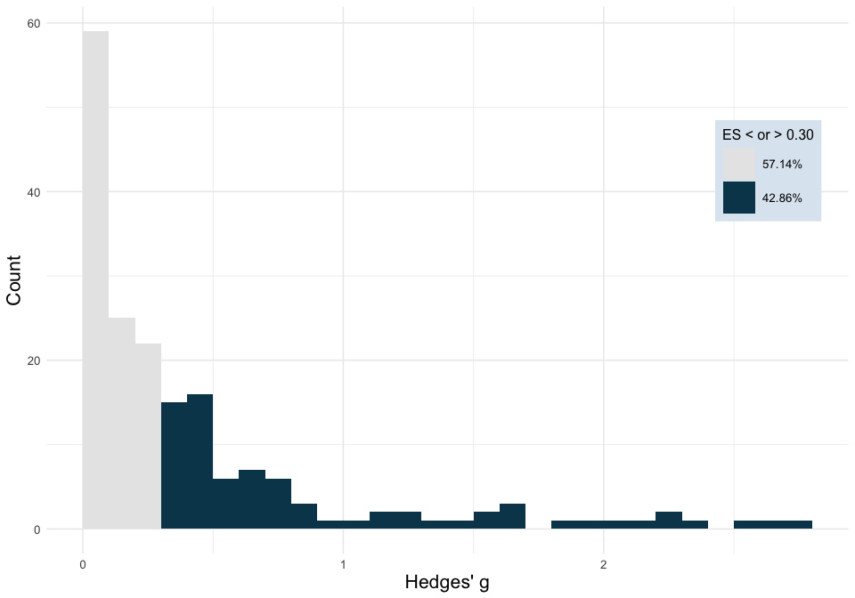
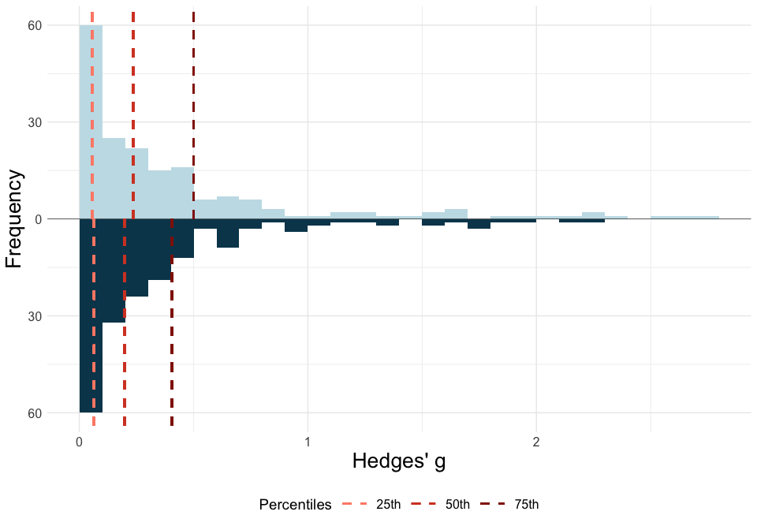
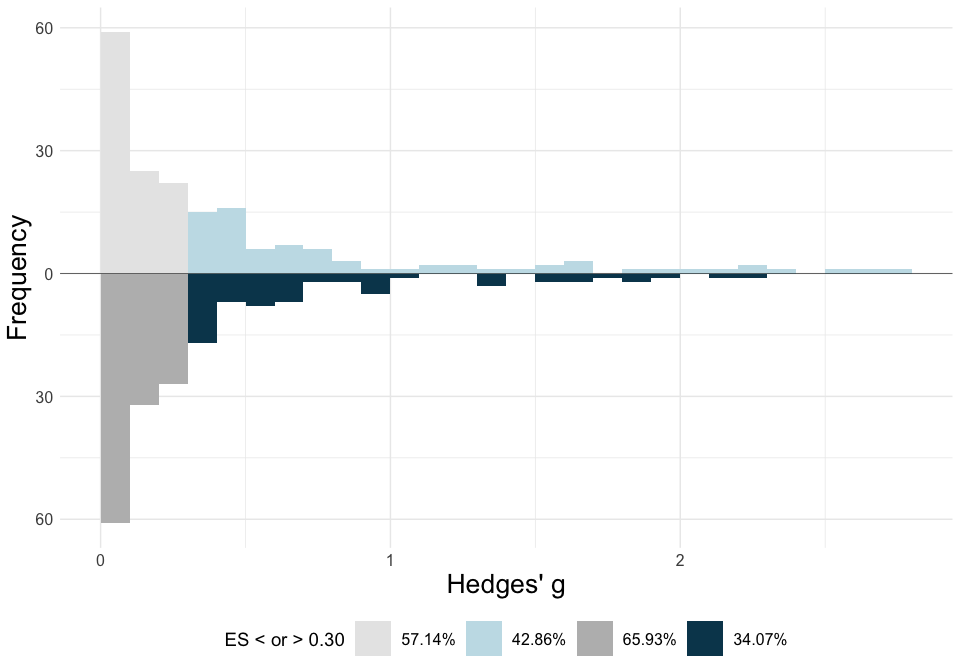

<!-- README.md is generated from README.Rmd. Please edit that file -->

# ESDist: Calculate and visualise field-specific ESDs

<!-- badges: start -->
<!-- badges: end -->

## Description

The `ESDist` package is designed to calculate and visualise
field-specific effect size distributions, based on data that can easily
be obtained from meta-analyses.

[](https://zenodo.org/badge/latestdoi/532824630)

### Installation

You can install the `ESDist` package from [GitHub](https://github.com/)
with:

``` r
library(devtools)
devtools::install_github("berntgl/ESDist")
#> utf8    (1.2.3 -> 1.2.4) [CRAN]
#> vctrs   (0.6.3 -> 0.6.4) [CRAN]
#> fansi   (1.0.4 -> 1.0.5) [CRAN]
#> ggplot2 (3.4.3 -> 3.4.4) [CRAN]
#> 
#> The downloaded binary packages are in
#>  /var/folders/j7/lmhpj_jj73qfc31klr2wh3vw0000gp/T//Rtmp0NjmSX/downloaded_packages
#> ── R CMD build ─────────────────────────────────────────────────────────────────
#> * checking for file ‘/private/var/folders/j7/lmhpj_jj73qfc31klr2wh3vw0000gp/T/Rtmp0NjmSX/remotesca616aeeb2f/berntgl-ESDist-b4c73d8/DESCRIPTION’ ... OK
#> * preparing ‘ESDist’:
#> * checking DESCRIPTION meta-information ... OK
#> * checking for LF line-endings in source and make files and shell scripts
#> * checking for empty or unneeded directories
#> * building ‘ESDist_0.0.0.9000.tar.gz’
```

### Data structure

The `ESDist` package is designed for datasets containing data that can
easily be extracted from pre-existing meta-analyses. As such, most
functions in this package work on a dataset that only contains a column
with effect sizes. However, for some functions and additional
functionalities, users might want to include some grouping variable or
other study information. For the publication bias-adjusted functions,
users need a column with the standard error for each study effect size.
Alternatively, users can include a column with the lower bound of the
95% confidence interval, and one for the upper bound. The `ot_dat`
dataset included in the `ESDist` package contains several columns in
addition to the effect size column (`yi`).

``` r
head(ESDist::ot_dat)
#>          meta_analysis  meta_analysis_doi meta_analysis_year          study
#> 1 bakermans_kranenburg 10.1038/tp.2013.34               2018    andari_2010
#> 2 bakermans_kranenburg 10.1038/tp.2013.34               2018  averbeck_2012
#> 3 bakermans_kranenburg 10.1038/tp.2013.34               2018  den-boer_1992
#> 4 bakermans_kranenburg 10.1038/tp.2013.34               2018 epperson_1996a
#> 6 bakermans_kranenburg 10.1038/tp.2013.34               2018    feifel_2010
#> 7 bakermans_kranenburg 10.1038/tp.2013.34               2018   goldman_2011
#>                        study_doi study_year     yi lower upper   sei group
#> 1        10.1073/pnas.0910249107       2010  0.534    NA    NA 0.281   ASD
#> 2      10.1017/S0033291711001413       2012  0.192    NA    NA 0.192   SCZ
#> 3   10.1016/0196-9781(92)90010-Z       1992 -0.877    NA    NA 0.563   OCD
#> 4   10.1016/0006-3223(96)00120-5       1996  0.461    NA    NA 0.226   OCD
#> 6 10.1016/j.biopsych.2010.04.039       2010  0.520    NA    NA 0.265   SCZ
#> 7      10.1007/s00213-011-2193-8       2011  0.000    NA    NA 0.262   SCZ
#>   group_secondary favours_oxytocin    doses  meta_analysis_pop_ind  design n1
#> 1                         positive   single bakermans_kranenburg_1  Within NA
#> 2                         positive   single bakermans_kranenburg_1  Within NA
#> 3                         positive multiple bakermans_kranenburg_1 Between  6
#> 4                         positive multiple bakermans_kranenburg_1  Within NA
#> 6                         positive multiple bakermans_kranenburg_1  Within NA
#> 7                         positive   single bakermans_kranenburg_1  Within NA
#>   n2 n_total   es_type raw_es ID raw_se df  h_factor
#> 1 NA      13 Cohen's d   0.57  1   0.30 12 0.9361702
#> 2 NA      21 Cohen's d   0.20  2   0.20 20 0.9620253
#> 3  6      NA Cohen's d  -0.95  4   0.61 10 0.9230769
#> 4 NA       7 Cohen's d   0.53  5   0.26  6 0.8695652
#> 6 NA      15 Cohen's d   0.55  7   0.28 14 0.9454545
#> 7 NA      13 Cohen's d   0.00  8   0.28 12 0.9361702
```

## esd_plot()

### Plot a simple ESD

The `esd_plot()` function can visualise ESDs based on effect size
estimates obtained from meta-analyses.

``` r
library(ESDist)
```

``` r
plot1 <- esd_plot(df = ot_dat,
         es = yi,
         es_type = "Hedges' g")

plot1
```

<!-- -->

### Plot effect size benchmarks

It is also possible to plot effect size benchmarks based on the 25th,
50th, and 75th percentiles by adding `method = "quads"` (or based on the
16.65th, 50th, and 83.35th percentiles by adding `method = "thirds"`).

``` r
plot2 <- esd_plot(df = ot_dat,
         es = yi,
         es_type = "Hedges' g",
         method = "quads")

plot2
```

<!-- -->

### Plot empirical effect size ranges

Finally, we can specify the range of effect sizes that is equal to or
larger than a specified `sesoi`.

``` r
plot3 <- esd_plot(df = ot_dat,
         es = yi,
         es_type = "Hedges' g",
         sesoi = 0.3)

plot3
```

<!-- -->

## esd_plot_group()

### Simple plot per group

The `esd_plot_group()` function allows for specifying a `grouping_var`
to group data and create plots for each group with 20 or more effect
sizes.

``` r
plot4 <- esd_plot_group(df = ot_dat,
         es = yi,
         es_type = "Hedges' g",
         grouping_var = group)

plot4
```

<!-- -->

### Plot effect size benchmarks per group.

Like the `esd_plot()` function, the `esd_plot_group()` function lets you
plot effect size benchmarks based on a specific set of percentiles, by
adding `method = "quads"` or `method = "thirds"`.

``` r
plot5 <- esd_plot_group(df = ot_dat,
         es = yi,
         es_type = "Hedges' g",
         grouping_var = group,
         method = "quads")

plot5
```

<!-- -->

## esd_plot_pba()

### Plot an adjusted ESD against a raw ESD.

Using the `meta` and `metasens` packages (Schwarzer et al., 2023), we
can adjust every individual effect size for publication bias, and plot
the adjusted distribution against theraw distribution.

First, we need to import the `meta` and `metasens` packages

``` r
library(meta)
library(metasens)
```

Next, we create an object of class ‘meta’ (m1), and subsequently use
this to create an object of class ‘limitmeta’ (l1).

``` r
m1 <- metagen(TE = ot_dat$yi, seTE = ot_dat$sei)
l1 <- limitmeta(m1)
```

We can now use the `l1` object to create our distribution.

``` r
plot6 <- esd_plot_pba(lim_obj = l1, 
          es_type = "Hedges' g")

plot6
```

<!-- -->

Alternatively, we can plot the effect size benchmarks for both
distributions.

``` r
plot7 <- esd_plot_pba(lim_obj = l1, 
          es_type = "Hedges' g",
          method = "quads")
plot7
```

<!-- -->

Or the range of effect sizes larger than or equal to a SESOI

``` r
plot8 <- esd_plot_pba(l1, 
          "Hedges' g",
          sesoi = 0.3)
plot8
```

<!-- -->

## esd_table()

### Calculate effect size benchmarks for whole dataset

By using the `esd_table()` function, you can calculate the effect size
benchmarks for your dataset by specifying the dataset (`df`), and the
column containing all effect sizes (`es`). This will give you the effect
size benchmarks based on the 25th, 50th, and 75th percentiles.

``` r
library(ESDist)
library(dplyr)
```

``` r
table1 <- esd_table(df = ot_dat,
                    es = yi)

table1
#>                  25%  50% 75% Number of effects
#> Raw effect size 0.06 0.24 0.5               182
```

### Calculate effect size benchmarks per group

By specifying `grouping_var`, the user can calculate the effect size
benchmarks per group, for every group with at least three effect sizes.
(The number of required effect sizes per group can be overwritten by
specifying `min_group_size`.)

``` r
table3 <- esd_table(df = ot_dat,
                    es = yi,
                    grouping_var = group)

table3
#>          Group  25%  50%  75% Number of effects
#> 1           AN 0.02 0.05 0.06                 6
#> 2          ASD 0.11 0.31 0.55                32
#> 3          BPD 0.16 1.22 2.29                 5
#> 4         PTSD 0.20 0.32 0.38                 6
#> 5          SCZ 0.05 0.13 0.24                20
#> 6      anxiety 0.19 0.31 0.41                 4
#> 7   depression 0.21 0.45 0.91                 6
#> 8 neurotypical 0.05 0.25 0.66                89
#> 9          All 0.06 0.24 0.50               182
```

## esd_table_pba()

The `esd_table_pba()` function allows users to use an object of type
`limitmeta` to calculate benchmarks based on effect sizes that are
adjusted for publication bias.

``` r
table4 <- esd_table_pba(lim_obj = l1)

table4
#>                       25%  50%  75% Number of effects
#> Raw effect size      0.06 0.24 0.50               182
#> Adjusted effect size 0.08 0.20 0.39               182
```

In case the user wants effect size benchmarks per group, the user should
define the `subgroup` argument when defining the `meta` object:

``` r
m2 <- metagen(TE = ot_dat$yi, seTE = ot_dat$sei, subgroup = ot_dat$group)
l2 <- limitmeta(m2)
```

Then, in the `esd_table_pba()` function, the `grouping` argument should
be set to `TRUE`.

``` r
table5 <- esd_table_pba(lim_obj = l2,
                    grouping = TRUE)

table5
#>                        25%  50%  75% Number of effects
#> AN                    0.02 0.05 0.06                 6
#> AN adjusted           0.04 0.07 0.09                 6
#> ASD                   0.11 0.31 0.55                32
#> ASD adjusted          0.10 0.23 0.39                32
#> BPD                   0.16 1.22 2.29                 5
#> BPD adjusted          0.19 0.92 1.82                 5
#> PTSD                  0.20 0.32 0.38                 6
#> PTSD adjusted         0.12 0.22 0.29                 6
#> SCZ                   0.05 0.13 0.24                20
#> SCZ adjusted          0.08 0.15 0.18                20
#> anxiety               0.19 0.31 0.41                 4
#> anxiety adjusted      0.06 0.21 0.36                 4
#> depression            0.21 0.45 0.91                 6
#> depression adjusted   0.14 0.37 0.72                 6
#> neurotypical          0.05 0.25 0.66                89
#> neurotypical adjusted 0.06 0.20 0.55                89
#> All                   0.06 0.24 0.50               182
#> All adjusted          0.08 0.20 0.39               182
```

### Editing and saving tables

The values presented in the table default to two decimal places. This
can be overwritten by setting `ndec` to the desired number of decimal
places. Tables can be saved by setting `csv_write` to `TRUE`.
Optionally, by setting `file_name` to a string specifying the
sub-directory and file name (e.g., `sub-folder/table.csv`), the table
can be saved to a specific location with a specific name.

## esd_perc()

### Calculating the percentile of a value

Using `esd_perc()`, you can calculate to which percentile of the ESD a
given value corresponds. Note that absolute effect size values should be
used.

``` r
library(ESDist)
library(dplyr)
library(ggplot2)
```

``` r
esd_perc(df = ot_dat,
         es = yi,
         value = 0.3)
#> [1] 57.14286
```
