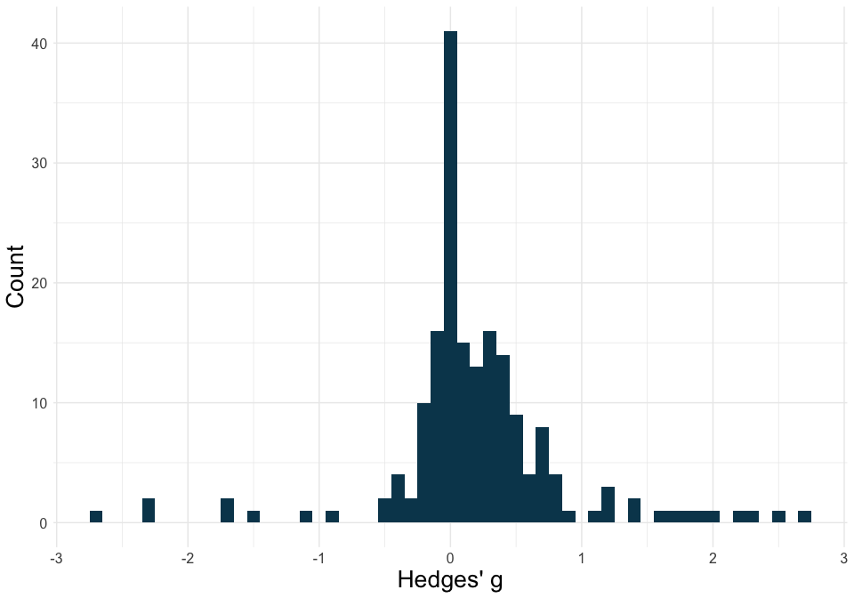
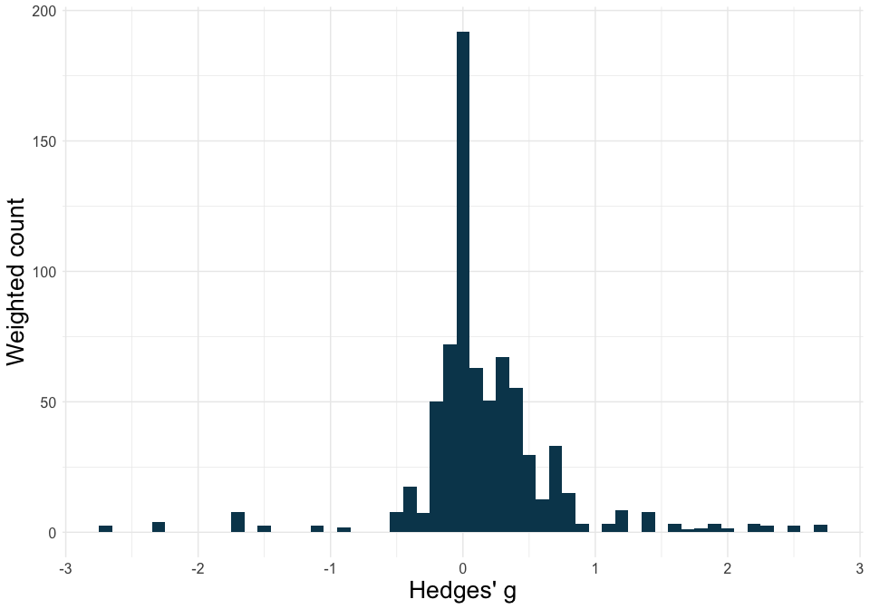
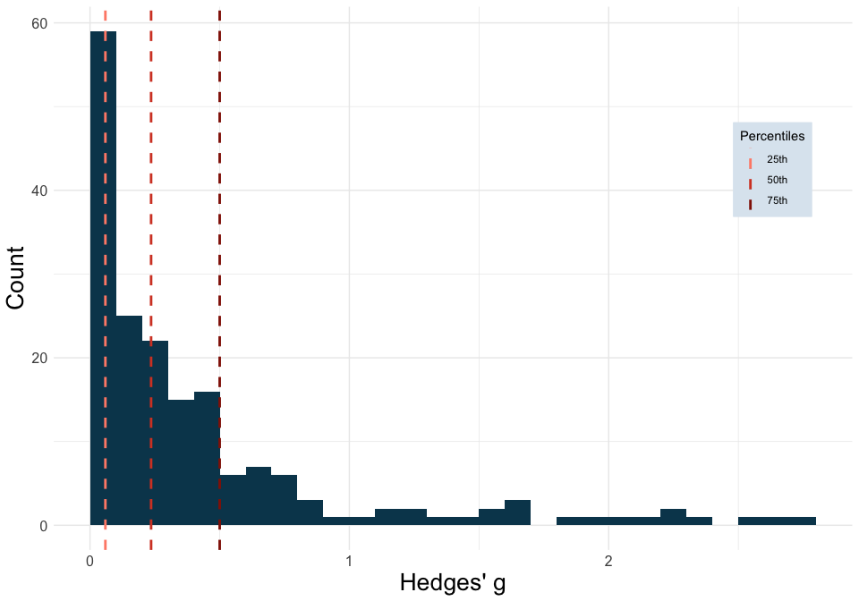
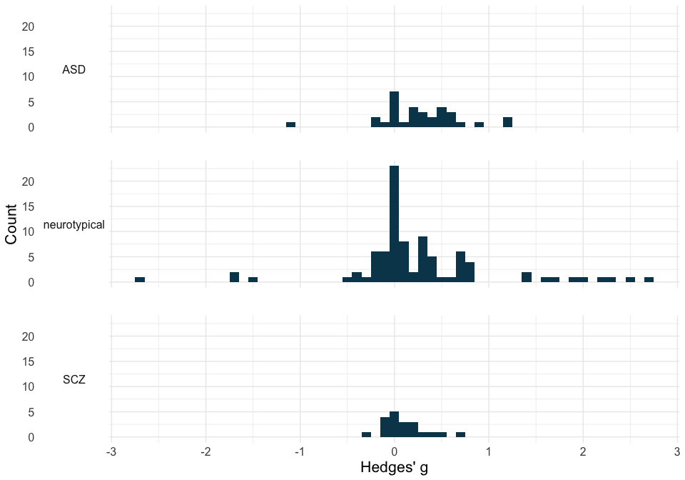

<!-- README.md is generated from README.Rmd. Please edit that file -->

# ESDist: Calculate and visualise field-specific ESDs

<!-- badges: start -->
<!-- badges: end -->

## Description

The `ESDist` package is designed to calculate and visualise
field-specific effect size distributions, based on data that can easily
be obtained from meta-analyses.

[](https://zenodo.org/badge/latestdoi/532824630)

### Installation

You can install the `ESDist` package from [GitHub](https://github.com/)
with:

``` r
library(devtools)
devtools::install_github("berntgl/ESDist")
```

    #> ℹ Loading ESDist

### Data structure

The `ESDist` package is designed for datasets containing data that can
easily be extracted from pre-existing meta-analyses. As such, most
functions in this package work on a dataset that only contains a column
with effect sizes. However, for some functions and additional
functionalities, users might want to include some grouping variable or
other study information. For the publication bias-adjusted functions,
users need a column with the standard error for each study effect size.
Alternatively, users can include a column with the lower bound of the
95% confidence interval, and one for the upper bound. The `ot_dat`
dataset included in the `ESDist` package contains several columns in
addition to the effect size column (`yi`).

``` r
head(ESDist::ot_dat)
#>          meta_analysis  meta_analysis_doi meta_analysis_year          study
#> 1 bakermans_kranenburg 10.1038/tp.2013.34               2018    andari_2010
#> 2 bakermans_kranenburg 10.1038/tp.2013.34               2018  averbeck_2012
#> 3 bakermans_kranenburg 10.1038/tp.2013.34               2018  den-boer_1992
#> 4 bakermans_kranenburg 10.1038/tp.2013.34               2018 epperson_1996a
#> 6 bakermans_kranenburg 10.1038/tp.2013.34               2018    feifel_2010
#> 7 bakermans_kranenburg 10.1038/tp.2013.34               2018   goldman_2011
#>                        study_doi study_year     yi lower upper   sei group
#> 1        10.1073/pnas.0910249107       2010  0.534    NA    NA 0.281   ASD
#> 2      10.1017/S0033291711001413       2012  0.192    NA    NA 0.192   SCZ
#> 3   10.1016/0196-9781(92)90010-Z       1992 -0.877    NA    NA 0.563   OCD
#> 4   10.1016/0006-3223(96)00120-5       1996  0.461    NA    NA 0.226   OCD
#> 6 10.1016/j.biopsych.2010.04.039       2010  0.520    NA    NA 0.265   SCZ
#> 7      10.1007/s00213-011-2193-8       2011  0.000    NA    NA 0.262   SCZ
#>   group_secondary favours_oxytocin    doses  meta_analysis_pop_ind  design n1
#> 1                         positive   single bakermans_kranenburg_1  Within NA
#> 2                         positive   single bakermans_kranenburg_1  Within NA
#> 3                         positive multiple bakermans_kranenburg_1 Between  6
#> 4                         positive multiple bakermans_kranenburg_1  Within NA
#> 6                         positive multiple bakermans_kranenburg_1  Within NA
#> 7                         positive   single bakermans_kranenburg_1  Within NA
#>   n2 n_total   es_type raw_es ID raw_se df  h_factor
#> 1 NA      13 Cohen's d   0.57  1   0.30 12 0.9361702
#> 2 NA      21 Cohen's d   0.20  2   0.20 20 0.9620253
#> 3  6      NA Cohen's d  -0.95  4   0.61 10 0.9230769
#> 4 NA       7 Cohen's d   0.53  5   0.26  6 0.8695652
#> 6 NA      15 Cohen's d   0.55  7   0.28 14 0.9454545
#> 7 NA      13 Cohen's d   0.00  8   0.28 12 0.9361702
```

## esd_plot()

### Plot a simple ESD

The `esd_plot()` function can visualise ESDs based on effect size
estimates obtained from meta-analyses.

``` r
library(ESDist)
```

``` r
plot1 <- esd_plot(df = ot_dat,
                  es = yi,
                  es_type = "Hedges' g")

plot1
```

<!-- -->

### Plot a weighted ESD

By supplying standard errors to the `esd_plot()` function’s `se`
argument, and setting `weighted` to `TRUE`, it is possible to plot a
weighted ESD, based on the inverse standard error. This effectively
means that more information is drawn from more precise effect size
estimates (i.e., effect sizes with a smaller standard error).

``` r
plot2 <- esd_plot(df = ot_dat,
                  es = yi,
                  se = sei,
                  weighted = TRUE,
                  es_type = "Hedges' g")

plot2
```

<!-- -->

### Plot effect size benchmarks

It is also possible to plot effect size benchmarks based on the 25th,
50th, and 75th percentiles by adding `method = "quads"` (or based on the
16.65th, 50th, and 83.35th percentiles by adding `method = "thirds"`).

``` r
plot3 <- esd_plot(df = ot_dat,
                  es = yi,
                  es_type = "Hedges' g",
                  method = "quads")

plot3
```

<!-- -->

### Plot empirical effect size ranges

Finally, we can specify the range of effect sizes that is equal to or
larger than a specified `sesoi`.

``` r
plot4 <- esd_plot_pba(df = ot_dat,
                  es = yi,
                  se = sei,
                  es_type = "Hedges' g",
                  sesoi = 0.3)

plot4
```

<!-- -->

## esd_plot_group()

### Simple plot per group

The `esd_plot_group()` function allows for specifying a `grouping_var`
to group data and create plots for each group with 20 or more effect
sizes. It otherwise takes the same arguments as the standard
`esd_plot()` function (with the exception of the `sesoi` argument).

``` r
plot5 <- esd_plot_group(df = ot_dat,
                        es = yi,
                        es_type = "Hedges' g",
                        grouping_var = group)

plot5
```

<!-- -->

## esd_plot_pba()

### Plot an adjusted ESD against a raw ESD.

Using limit meta analysis (Schwarzer et al., 2023), we can adjust every
individual effect size for publication bias and plot the adjusted
distribution against the raw distribution. To do this, the
`esd_plot_pba()` function takes an additional `se` argument. Otherwise,
it takes the same arguments as the `esd_plot()` function for additional
functionality.

``` r
plot6 <- esd_plot_pba(df = ot_dat,
                       es = yi,
                       se = sei,
                       es_type = "Hedges' g")

plot6
```

<!-- -->

## esd_table()

### Calculate effect size benchmarks for whole dataset

By using the `esd_table()` function, you can calculate the effect size
benchmarks for your dataset by specifying the dataset (`df`), and the
column containing all effect sizes (`es`). This will give you the effect
size benchmarks based on the 25th, 50th, and 75th percentiles.

``` r
library(ESDist)
library(dplyr)
```

``` r
table1 <- esd_table(df = ot_dat,
                    es = yi)

table1
#>                  25%  50% 75% Number of effects
#> Raw effect size 0.06 0.24 0.5               182
```

### Calculate effect size benchmarks per group

By specifying `grouping_var`, the user can calculate the effect size
benchmarks per group, for every group with at least three effect sizes.
(The number of required effect sizes per group can be overwritten by
specifying `min_group_size`.)

``` r
table2 <- esd_table(df = ot_dat,
                    es = yi,
                    grouping_var = group)

table2
#>          Group  25%  50%  75% Number of effects
#> 1           AN 0.02 0.05 0.06                 6
#> 2          ASD 0.11 0.31 0.55                32
#> 3          BPD 0.16 1.22 2.29                 5
#> 4         PTSD 0.20 0.32 0.38                 6
#> 5          SCZ 0.05 0.13 0.24                20
#> 6      anxiety 0.19 0.31 0.41                 4
#> 7   depression 0.21 0.45 0.91                 6
#> 8 neurotypical 0.05 0.25 0.66                89
#> 9          All 0.06 0.24 0.50               182
```

### Calculate effect size benchmarks from a weighted distribution

By specifying `se` and setting `weighted` to `TRUE`, it is possible to
calculate benchmark estimates from a distribution that is weighted by
inverse standard error, taking more information from precise estimates
(i.e., effect size estimates with a lower standard error)

``` r
table3 <- esd_table(df = ot_dat,
                    es = yi,
                    se = sei,
                    weighted = TRUE)

table3
#>                  25% 50%  75% Number of effects
#> Raw effect size 0.05 0.2 0.43               182
```

## esd_table_pba()

The `esd_table_pba()` function, similar to the `esd_plot_pba()`
function, allows users to calculate effect size benchmarks that are
adjusted for publication bias. Otherwise, this function takes the same
additional arguments as the standard `esd_table()` function.

``` r
table4 <- esd_table_pba(df = ot_dat,
                        es = yi,
                        se = sei)

table4
#>                       25%  50%  75% Number of effects
#> Raw effect size      0.06 0.24 0.50               182
#> Adjusted effect size 0.08 0.20 0.39               182
```

### Editing and saving tables

The values presented in the table default to two decimal places. This
can be overwritten by setting `ndec` to the desired number of decimal
places. Tables can be saved by setting `csv_write` to `TRUE`.
Optionally, by setting `file_name` to a string specifying the
sub-directory and file name (e.g., `sub-folder/table.csv`), the table
can be saved to a specific location with a specific name.

## esd_perc()

### Calculating the percentile of a value

Using `esd_perc()`, you can calculate to which percentile of the ESD a
given value corresponds. Note that absolute effect size values should be
used.

``` r
library(ESDist)
library(dplyr)
library(ggplot2)
```

``` r
esd_perc(df = ot_dat,
         es = yi,
         value = 0.3)
#> [1] 57.14286
```
