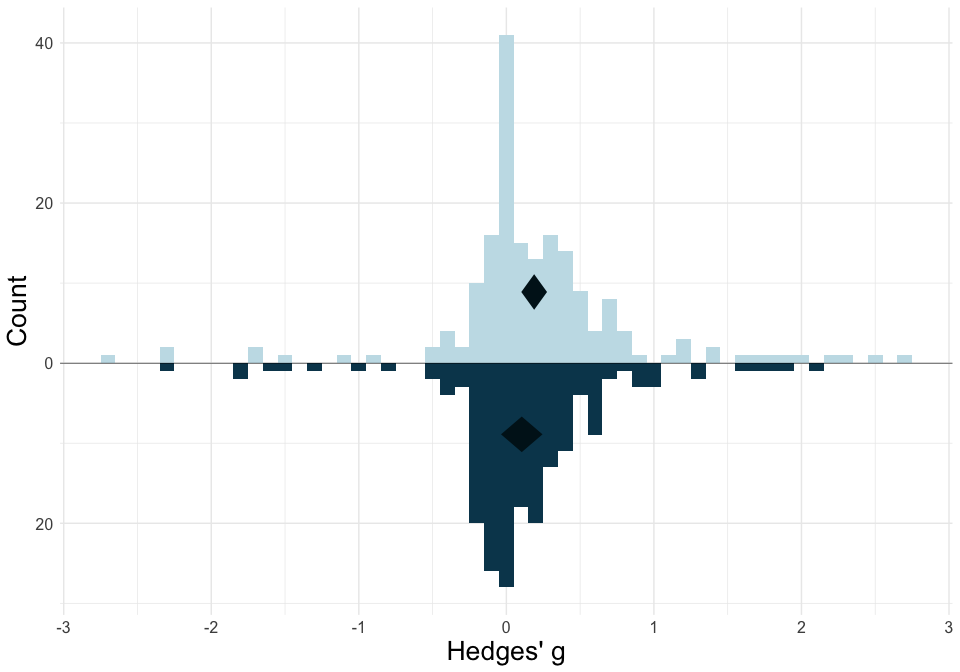
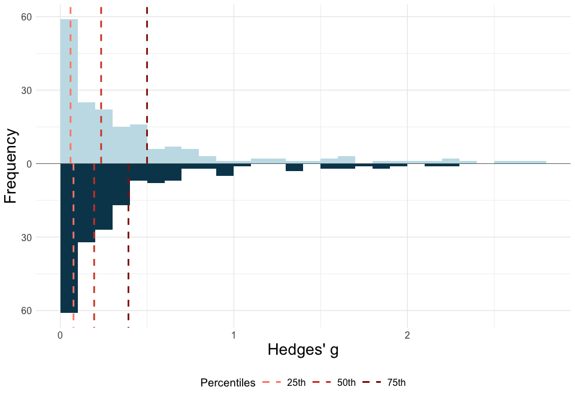

<!-- README.md is generated from README.Rmd. Please edit that file -->

# ESDist: Calculate and visualise field-specific ESDs

<!-- badges: start -->
<!-- badges: end -->

## Description

The `ESDist` package is designed to calculate and visualise
field-specific effect size distributions, based on data that can easily
be obtained from meta-analyses.

### Installation

You can install the ESDist package from [GitHub](https://github.com/)
with:

``` r
# install.packages("devtools")
devtools::install_github("berntgl/ESDist")
```

## esd_plot()

### Plot a simple ESD

The `esd_plot()` function can visualise ESDs based on effect size
estimates obtained from meta-analyses.

``` r
library(ESDist)
library(dplyr)
library(ggplot2)
```

``` r
plot1 <- esd_plot(df = ot_dat,
         es = yi,
         es_type = "Hedges' g")

plot1
```


By adding `mean = "mean"`, we can plot the true mean of this
distribution.

``` r
plot2 <- esd_plot(df = ot_dat,
         es = yi,
         es_type = "Hedges' g",
         mean = "mean")

plot2
```


### Plot effect size benchmarks

It is also possible to plot effect size benchmarks based on the 25th,
50th, and 75th percentiles by adding `method = "quads"` (or based on the
16.65th, 50thf, and 83.35th percentiles by adding `method = "thirds"`).
Note that only absolute effect sizes are used to accomplish this.

``` r
plot3 <- esd_plot(df = ot_dat,
         es = yi_abs,
         es_type = "Hedges' g",
         method = "quads")

plot3
```


### Plot empirical effect size ranges

Finally, we can specify the range of effect sizes that is equal to or
larger than a specified `sesoi`. Note that only absolute effect sizes
are used to accomplish this.

``` r
plot4 <- esd_plot(df = ot_dat,
         es = yi_abs,
         es_type = "Hedges' g",
         sesoi = 0.2)

plot4
```


## esd_plot_group()

### Simple plot per group

The `esd_plot_group()` function allows for specifying a `grouping_var`
to group data and create plots for each group with 20 or more effect
sizes.

``` r
plot5 <- esd_plot_group(df = ot_dat,
         es = yi,
         es_type = "Hedges' g",
         grouping_var = group)

plot5
```


### Plot effect size benchmarks per group.

Like the `esd_plot()` function, the `esd_plot_group()` function lets you
plot effect size benchmarks based on a specific set of percentiles, by
adding `method = "quads"` or `method = "thirds"`. Note that only
absolute effect sizes are used to accomplish this.

``` r
plot6 <- esd_plot_group(df = ot_dat,
         es = yi_abs,
         es_type = "Hedges' g",
         grouping_var = group,
         method = "thirds")

plot6
```


## esd_plot_pba()

### Plot an adjusted ESD against a raw ESD.

Using the `meta` and `metasens` packages (Schwarzer et al., 2023), we
can adjust every individual effect size for publication bias, and plot
the adjusted distribution against theraw distribution.

First, we need to import the `meta` and `metasens` packages

``` r
library(meta)
library(metasens)
```

Next, we create an object of class ‘meta’ (m1), and subsequently use
this to create an object of class ‘limitmeta’ (l1).

``` r
m1 <- metagen(TE = ot_dat$yi, seTE = ot_dat$sei)
l1 <- limitmeta(m1)
```

We can now use the `l1` object to create our distribution.

``` r
plot7 <- esd_plot_pba(l1, 
          "Hedges' g")

plot7
#> Warning: The dot-dot notation (`..count..`) was deprecated in ggplot2 3.4.0.
#> ℹ Please use `after_stat(count)` instead.
#> ℹ The deprecated feature was likely used in the ESDist package.
#>   Please report the issue to the authors.
#> This warning is displayed once every 8 hours.
#> Call `lifecycle::last_lifecycle_warnings()` to see where this warning was
#> generated.
```



Alternatively, we can plot the effect size benchmarks for both
distributions.

``` r
plot8 <- esd_plot_pba(l1, 
          "Hedges' g",
          method = "quads")
plot8
```



## esd_table()

### Calculate effect size benchmarks for whole dataset

By using the `esd_table()` function, you can calculate the effect size
benchmarks for your dataset by specifying the dataset (`df`), and the
column containing all effect sizes (`es`). This will give you the effect
size benchmarks based on the 25th, 50th, and 75th percentiles. Note that
only absolute effect sizes should be used.

``` r
library(ESDist)
library(dplyr)
```

``` r
table1 <- esd_table(df = ot_dat,
                    es = yi_abs)

table1
#>                 25%    50%    75%    Number of effects
#> Raw effect size "0.06" "0.24" "0.52" "182"
```

Alternatively, you can calculate benchmarks by splitting the
distribution into three equal-sized chunks, and calculating the median
of every third, which would correspond to the 16.65th, 50th, and 83.35th
percentiles. This can be achieved by adding `method = "thirds"` to the
code.

``` r
table2 <- esd_table(df = ot_dat,
                    es = yi_abs,
                    method = "thirds")

table2
#>                 16.65% 50%    83.35% Number of effects
#> Raw effect size "0.03" "0.24" "0.72" "182"
```

### Calculate effect size benchmarks per group

By specifying `grouping_var`, the user can calculate the effect size
benchmarks per group, for every group with at least three effect sizes.
(The number of required effect sizes per group can be overwritten by
specifying `min_group_size`.)

``` r
table3 <- esd_table(df = ot_dat,
                    es = yi_abs,
                    grouping_var = group)

table3
#>              25%    50%    75%    Number of effects
#> AN           "0.03" "0.05" "0.06" "6"              
#> ASD          "0.16" "0.33" "0.56" "31"             
#> BPD          "0.70" "1.22" "2.29" "5"              
#> OCD          "0.23" "0.46" "0.67" "3"              
#> PTSD         "0.20" "0.32" "0.38" "6"              
#> SCZ          "0.06" "0.14" "0.28" "20"             
#> anxiety      "0.19" "0.31" "0.41" "4"              
#> depression   "0.21" "0.45" "0.91" "6"              
#> neurotypical "0.04" "0.24" "0.66" "89"             
#> All          "0.06" "0.24" "0.52" "182"
```

### Editing and saving tables

The values presented in the table default to two decimal places. This
can be overwritten by setting `ndec` to the desired number of decimal
places. Tables can be saved by setting `csv_write` to `TRUE`.
Optionally, by setting `file_name` to a string specifying the
sub-directory and file name (e.g., `sub-folder/table.csv`), the table
can be saved to a specific location with a specific name.

## esd_perc()

### Calculating the percentile of a value

Using `esd_perc()`, you can calculate to which percentile of the ESD a
given value corresponds. Note that absolute effect size values should be
used.

``` r
library(ESDist)
library(dplyr)
library(ggplot2)
```

``` r
esd_perc(df = ot_dat,
         es = yi_abs,
         value = 0.2)
#> [1] 45.05495
```
